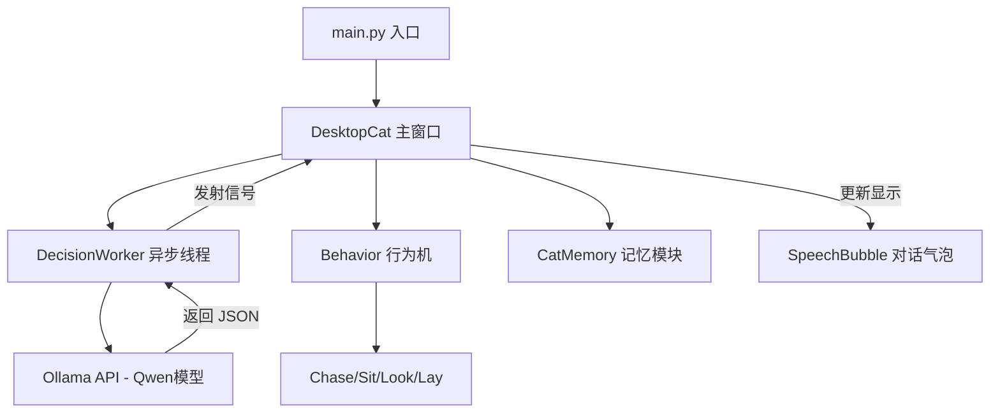

# 🐱 CyberCat-Mimi: 赛博桌面猫 (双版本版)

CyberCat-Mimi 是一个基于 **PyQt6** 构建的桌面宠物系统。本项目提供两个版本供您选择：

- **🤖 智能 AI 版 (推荐)**：位于根目录。由 **Ollama (Qwen)** 驱动，具备自主决策、智能对话和复杂的情绪/能量系统。
- **🎮 简单规则版**：位于 `simple_version/` 目录。轻量级单文件版，纯规则驱动，无须 AI 算力，适合快速体验和低配环境。

---

## ✨ 核心特性

- **🧠 自主意识决策**：每隔 8 秒，猫咪会通过环境感应（位置、能量、无聊度、历史记忆）调用 Ollama 模型进行自主行为决策。
- **💬 智能对话气泡**：支持右键唤起对话框。您可以与猫咪聊天，它会结合当前状态实时给出幽默、拟人化的回复。
- **🌈 动态行为系统**：
    - `sit` (坐下)：休养生息。
    - `look` (观察)：充满好奇。
    - `lay` (趴下)：深度恢复。
    - `chase` (追逐)：召唤出一只带轨迹的蝴蝶并全屏奔跑。
- **📊 属性模拟**：模拟能量（Energy）与无聊度（Boredom）的动态增减，数值将直接影响 AI 的决策逻辑。
- **🛡️ 鲁棒性加固**：强制 JSON 模式方案，并在后台自动过滤 `think` 推理块，确保解析零失败。

---

## 🏗️ 系统架构

项目采用模块化设计，方便开发者进行二次开发：



---

## 🚀 部署指南

### 1. 环境准备 (Conda)
推荐使用 Python 3.12 环境：
```bash
conda create -n cat python=3.12
conda activate cat
pip install PyQt6 httpx
```

### 2. 模型准备 (Ollama)
本项目默认使用 `qwen3:8b` (或 Qwen2.5-Instruct)。
1. 安装 [Ollama](https://ollama.com/)。
2. 运行模型：
   ```bash
   ollama pull qwen3:8b
   ollama serve
   ```
   *注意：如果您的模型名称不同，请在 `config.py` 中修改 `OLLAMA_MODEL`。*

### 3. 启动程序
```bash
python main.py
```

---

## 🛠️ 开发者指南 (如何增加新功能)

### 如何添加新动作？
1. **准备素材**：在 `config.py` 的 `ACTION_CONFIGS` 中添加素材切片的起始坐标。
2. **编写逻辑**：在 `behaviors/` 目录下创建一个继承自 `BaseBehavior` 的新类。
3. **注册行为**：在 `cat.py` 的 `self.behaviors` 字典中完成注册。
4. **大脑训练**：在 `brain/prompt_builder.py` 的 `VALID_ACTIONS` 列表中加入新动作名，模型即可感知并调用。

### 如何调整 AI 性格？
修改 `brain/prompt_builder.py` 中的 `SYSTEM_INSTRUCTION`，您可以配置猫咪是“傲娇”、“温柔”还是“科学怪人”。

---

## 📄 项目结构
```text
.
├── main.py            # 启动脚本
├── cat.py             # 主逻辑窗口与 UI 组件
├── config.py          # 全局配置中心
├── behaviors/         # 具体动作实现
│   ├── base.py
│   ├── chase.py
│   └── ...
├── brain/             # AI 决策核心
│   ├── llm_client.py  # Ollama 通信
│   ├── prompt_builder.py # 提示词工程
│   └── decision.py    # 异步线程逻辑
└── memory/            # 记忆管理
    └── memory.py
```

---

## 🌟 鸣谢
- 视觉素材：感谢 8-bit 猫咪开源素材（请根据实际路径替换）。
- 动力来源：Ollama 提供本地快速推断。

---
> **提示**：如果猫咪停留原地不动，请检查 Ollama 服务是否已开启，并确保控制台没有网络连接错误。
